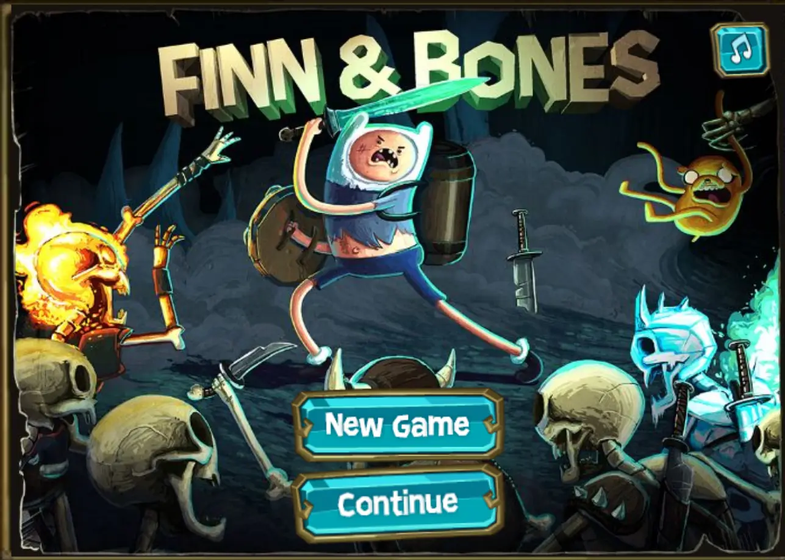
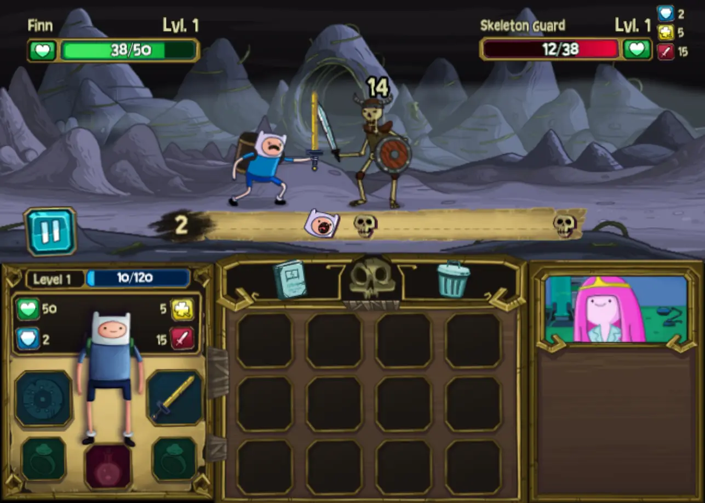

<h1 align="center">Finn & Bones HTML5 Archive</h1>
<h3 align="center">Play it <a href="https://danssmnt.github.io/FinnAndBones-Archive/"><b>here</b></a></h3>

---

    
    

---

Full archive of the HTML5 Finn & Bones game.

## Why?

By the end of 2024, the Cartoon Network website was shut down and, with that, many web games related to cartoons (like Adventure Time) went down too.

Finn & Bones was one of them, and it was my favorite. So, I decided to archive it here using [Wayback Machine](https://archive.org/) snapshots.

## FAQ

#### Will there be any updates to the game?
No, at least not from me. This is just an archive. The game's source code is heavily obfuscated (take a look at ``out.js``) and isn't maintainable.

Maybe one day with enough effort you could deobfuscate the code fully and get something where you can work on, but that would mean LOTS of effort.

#### You can play it on website *XYZ*!!!!
There's a diverse number of browser games websites which, to this day, host Finn & Bones and, sure, you can play on them if you want. Do keep in mind most of them (if not all) are crippled with ads / adware, host the Flash version and emulate it with Ruffle (which breaks sometimes), seem to be slower overall and steal and sell your data.

#### Why not just play the Flash version?
You _can_ still play the Flash version with _[Flashpoint](https://flashpointarchive.org/)_, but it's kinda slow and, besides that, it's always better to have it easily accessible on a browser instead of having to download a whole separate app just to play a game. (I do recommend _[Flashpoint](https://flashpointarchive.org/)_ for playing Flash / HTML5 games though)

#### Then why not just play the HTML5 version with Flashpoint?
"it's always better to have it easily accessible on a browser instead of having to download a whole separate app just to play a game"

#### Can you guarantee this archive lasts forever?
Depends on what the Cartoon Network's legal team thinks of this archive. As far as I know (I'm not a lawyer), this archive could be DMCA'd for copyright infringement. If that happens, then I'll be forced to take down this repository.

#### How much of my data is sent when I'm on the website?
To me? None.

To GitHub, see the **[Privacy Policy](https://docs.github.com/en/site-policy/privacy-policies/github-general-privacy-statement#github-pages)** for it.

To Cartoon Network, as far as I know, none too.

## Troubleshooting

#### Game / Menu text is vertically misaligned!
Allowing the website access to HTML5 canvas image data fixes the issue. On Firefox just press on the top-left image icon and then 'Allow'.

## Relevant content

Here you can find some links to community driven websites about the game. Check it out!

 - [Finn & Bones Speedruns](https://www.speedrun.com/fab)
 - [Finn & Bones Discord Server](https://discord.gg/9S28dD3FPv)
 - [Finn & Bones Fandom (wiki) page](https://finn-bones.fandom.com/wiki/Finn_%26_Bones_Wiki)